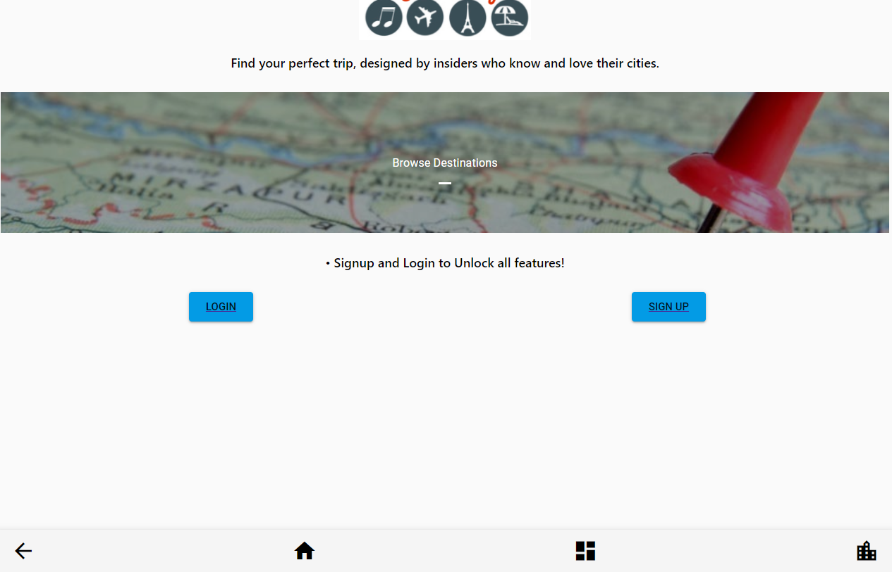

# Apricot

Fullstack application using React.JS (Redux), Node.JS, Express.JS, MongoDB (Mongoose), Multer, Passport, Google Authentication.

Welcome to the "Apricot/Hidden Gem App. A travel app built using the MERN stack with Material UI.

You will need to create a .env file in your root folder with the following info :

* MONGO_URI = "YOUR_OWN_MONGO_URI"

* SECRET_OR_KEY = "YOUR_OWN_SECRET"

* googleClientID = "YOUR_GOOGLECLIENTID_SECRET"

* googleClientSecret = "YOUR_GOOGLECLIENT_SECRET"

## Demo:

